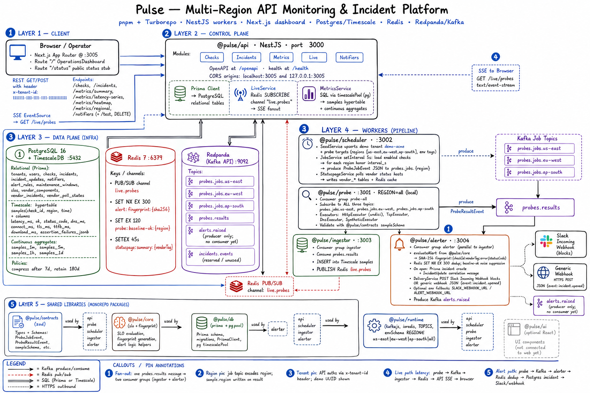

# Pulse — API Monitoring & Incident Platform

Multi-region API monitoring platform: schedule probes, store samples in TimescaleDB, open incidents with vendor correlation, stream live results to an ops dashboard, and notify Slack/webhooks.

TypeScript monorepo — **pnpm + Turborepo**, NestJS workers, Next.js 14 dashboard.

**Live (Oracle Cloud Always Free VM)**

| | |
|--|--|
| Dashboard | http://150.136.95.182:3005 |
| API health | http://150.136.95.182:3000/health |
| OpenAPI | http://150.136.95.182:3000/openapi |

> Public IP is ephemeral — if SSH or the UI stops working, check the current IP in the OCI Console.

Demo tenant: `11111111-1111-1111-1111-111111111111` (`demo-acme`)  
Probe regions: `us-east`, `eu-west`, `ap-south`

---

## Architecture



---

## Stack

| Layer | Choice |
|-------|--------|
| Services | NestJS 10 |
| Dashboard | Next.js 14 + Tailwind |
| Metadata | PostgreSQL 16 (Prisma) |
| Time-series | TimescaleDB (`samples` hypertable + continuous aggregates) |
| Bus | Redpanda (Kafka API) |
| Cache / live fanout | Redis 7 |
| Validation | Zod (`@pulse/contracts`) |
| Tests | Vitest (`@pulse/core`, `@pulse/contracts`) |

---

## Repository layout

```text
apps/
  api/          REST, metrics, SSE, notifiers, OpenAPI
  probe/        Regional probe workers (HTTP / TCP / DNS / synthetic)
  scheduler/    Job dispatch + Statuspage poller
  ingestor/     Sample write + Redis live fanout
  alerter/      Fingerprint dedupe → incidents → Slack/webhook
  web/          Ops dashboard
packages/
  contracts/    Zod schemas
  core/         SLO math + alert fingerprinting
  db/           Prisma + Timescale migrations
  runtime/      Kafka / Redis / env helpers
deploy/         Docker Compose (local + Oracle)
docs/           Architecture notes, deploy guide, benchmark results
scripts/        Local stack + Oracle bootstrap
```

---

## Deploy (Oracle Cloud)

Full guide: [docs/deploy-oracle.md](docs/deploy-oracle.md)

```bash
git clone https://github.com/rahulmallidi/Pulse-API-Monitoring-Incident-Platform.git
cd Pulse-API-Monitoring-Incident-Platform
chmod +x scripts/oracle-vm-bootstrap.sh
./scripts/oracle-vm-bootstrap.sh
```

Open ports **22 / 3000 / 3005** on the VCN security list. After bootstrap:

```bash
sudo docker compose -f deploy/docker-compose.oracle.yml ps
sudo docker compose -f deploy/docker-compose.oracle.yml logs -f api web
```

---

## Local development

**Requirements:** Node 20+, pnpm 9, Docker

```bash
pnpm install
pnpm dev:stack          # Postgres / Redis / Redpanda + all apps
pnpm dev:stack:fast     # skip DB bootstrap
pnpm dev:stack:force    # free ports, then fast start
pnpm dev:stack:down     # stop infra
```

| Surface | URL |
|---------|-----|
| Dashboard | http://localhost:3005 |
| API health | http://localhost:3000/health |
| OpenAPI | http://localhost:3000/openapi |

---

## API (control plane)

Most routes require:

```http
x-tenant-id: 11111111-1111-1111-1111-111111111111
```

| Area | Routes |
|------|--------|
| Checks | `GET/POST /checks`, `GET /checks/:id` |
| Incidents | `GET /incidents`, `PATCH /incidents/:id/state` |
| Live | `GET /live/probes` (SSE) |
| Metrics | `GET /metrics/{summary,latency-series,heatmap,regional}` |
| Notifiers | `GET/POST /notifiers`, `POST /notifiers/:id/test` |

---

## Alerting

Dashboard → **Alerts** → add a Slack or webhook notifier → **Test**.  
Delivery runs when the alerter opens an incident (Redis fingerprint dedup).

Optional env fallbacks: `SLACK_WEBHOOK_URL`, `ALERT_WEBHOOK_URL`.

---

## Tests & benchmarks

```bash
pnpm test:unit    # @pulse/core + @pulse/contracts
pnpm bench        # microbench + live API metrics (stack must be up)
```

**Unit tests** (2026-08-05):

| Package | Result | Line coverage |
|---------|--------|--------------:|
| `@pulse/core` | 8 passed | 84.84% |
| `@pulse/contracts` | 3 passed | 100% |

**Benchmark** (same date, local stack):

| Metric | Result |
|--------|--------|
| Alert fingerprint | ~259K ops/sec |
| `GET /health` p95 | ~69 ms (0 failures) |
| Samples / 24h | 45,389 across 3 regions |
| Probe p95 / uptime | ~1958 ms / ~87.6% |

Full JSON: [docs/benchmark-results.json](docs/benchmark-results.json)

---

## Troubleshooting

| Symptom | Fix |
|---------|-----|
| SSH timeout | Confirm instance **Running**, current public IP, security-list TCP **22** |
| UI / API unreachable | Security-list TCP **3000** / **3005**; `docker compose … ps` |
| `cannot drop table samples` | Pull latest `main`, re-run bootstrap (Timescale caggs handled before Prisma push) |
| No Slack alerts | Alerter up? Notifier saved? Incident actually opened? |

Probe targets / Statuspage hosts: see [SOURCE.md](SOURCE.md).
